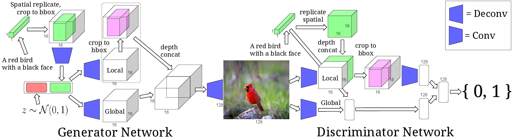
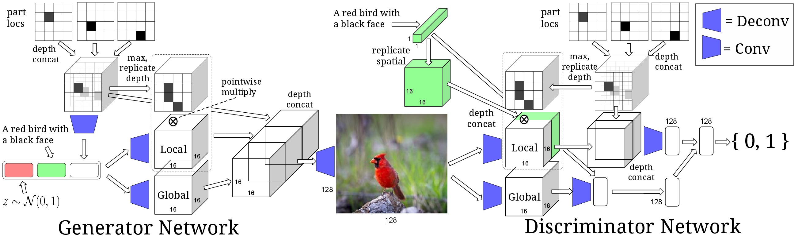
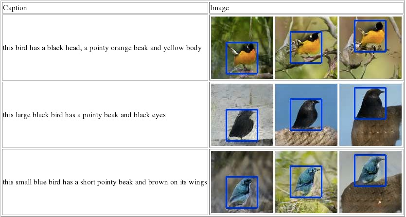
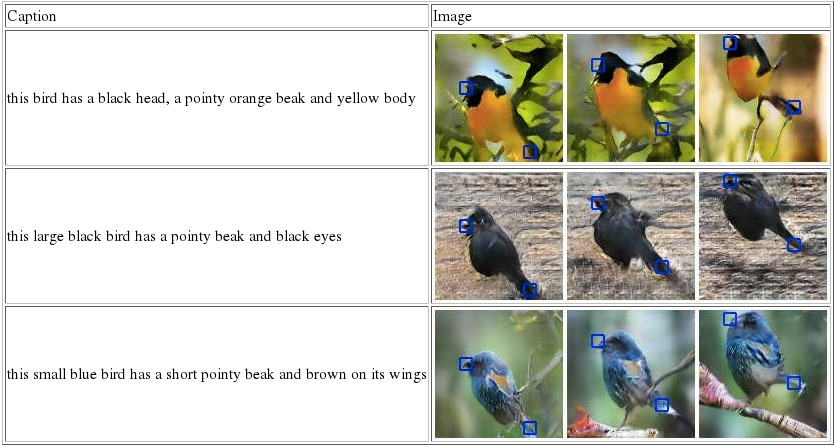
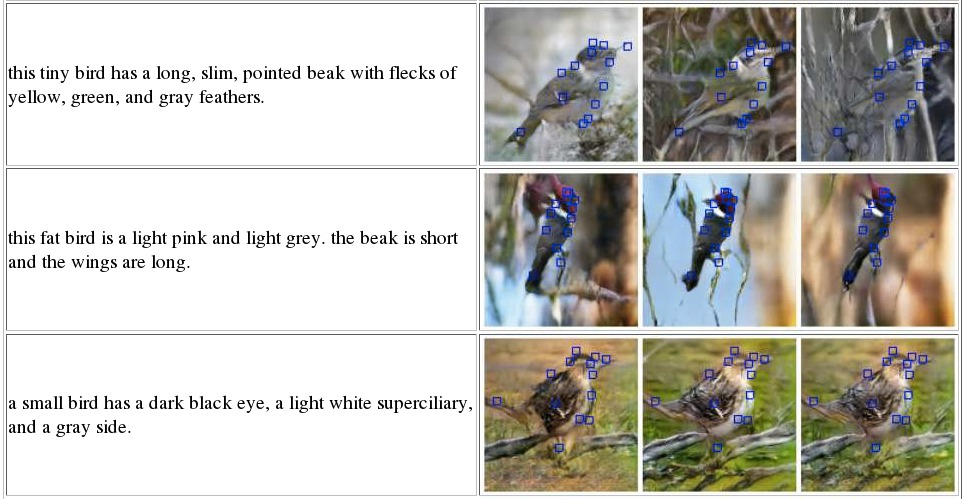
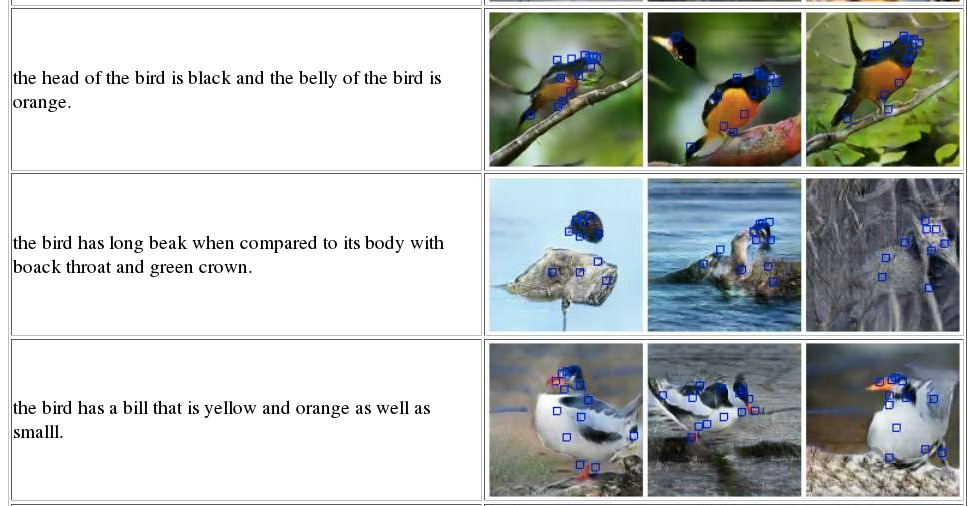
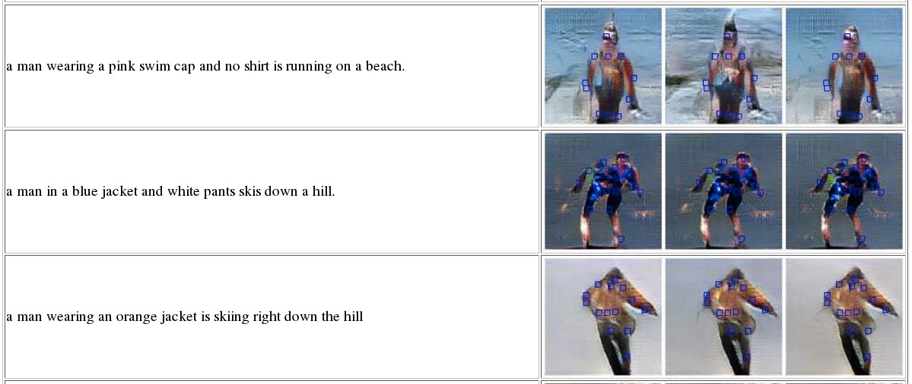
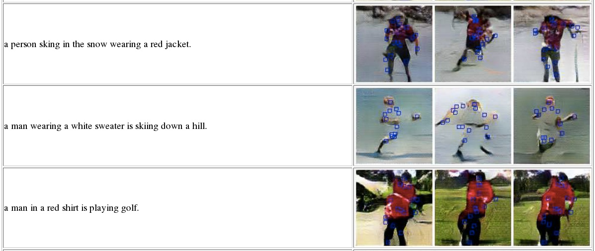

###<a href="http://umich.edu/~reedscot/nips2016.pdf">Learning What and Where to Draw</a>
Scott Reed, Zeynep Akata, Santosh Mohan, Samuel Tenka, Bernt Schiele, Honglak Lee

This is the code for our NIPS 2016 paper on text- and location-controllable image synthesis using conditional GANs. Much of the code is adapted from [reedscot/icml2016](https://github.com/reedscot/icml2016) and [dcgan.torch](https://github.com/soumith/dcgan.torch).




####Setup Instructions

You will need to install [Torch](http://torch.ch/docs/getting-started.html), CuDNN, [stnbhwd](https://github.com/qassemoquab/stnbhwd) and the [display](https://github.com/szym/display) package.

####How to train a text to image model:

1. Download the [data](https://drive.google.com/open?id=0B0ywwgffWnLLSl9EcDBBTXMtcGs) including captions, location annotations and pretrained models.
2. Download the [birds](http://www.vision.caltech.edu/visipedia/CUB-200-2011.html) and [humans](http://human-pose.mpi-inf.mpg.de/#download) image data.
4. Modify the `CONFIG` file to point to your data.
5. Run one of the training scripts, e.g. `./scripts/train_cub_keypoints.sh`

####How to generate samples:

* `./scripts/run_all_demos.sh`.
* html files will be generated with results like the following:

Moving the bird's position via bounding box:



Moving the bird's position via keypoints:



Birds text to image with ground-truth keypoints:



Birds text to image with generated keypoints:



Humans text to image with ground-truth keypoints:



Humans text to image with generated keypoints:



####Citation

If you find this useful, please cite our work as follows:

```
@inproceedings{reed2016learning,
  title={Learning What and Where to Draw},
  author={Scott Reed and Zeynep Akata and Santosh Mohan and Samuel Tenka and Bernt Schiele and Honglak Lee},
  booktitle={Advances in Neural Information Processing Systems},
  year={2016}
}
```
